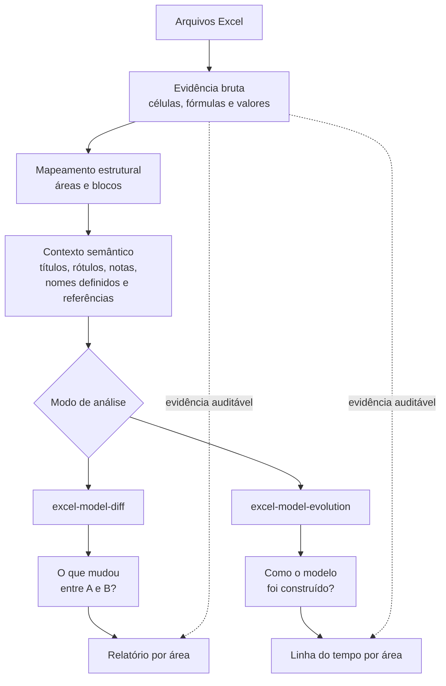
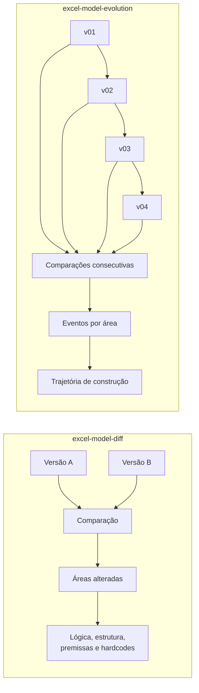
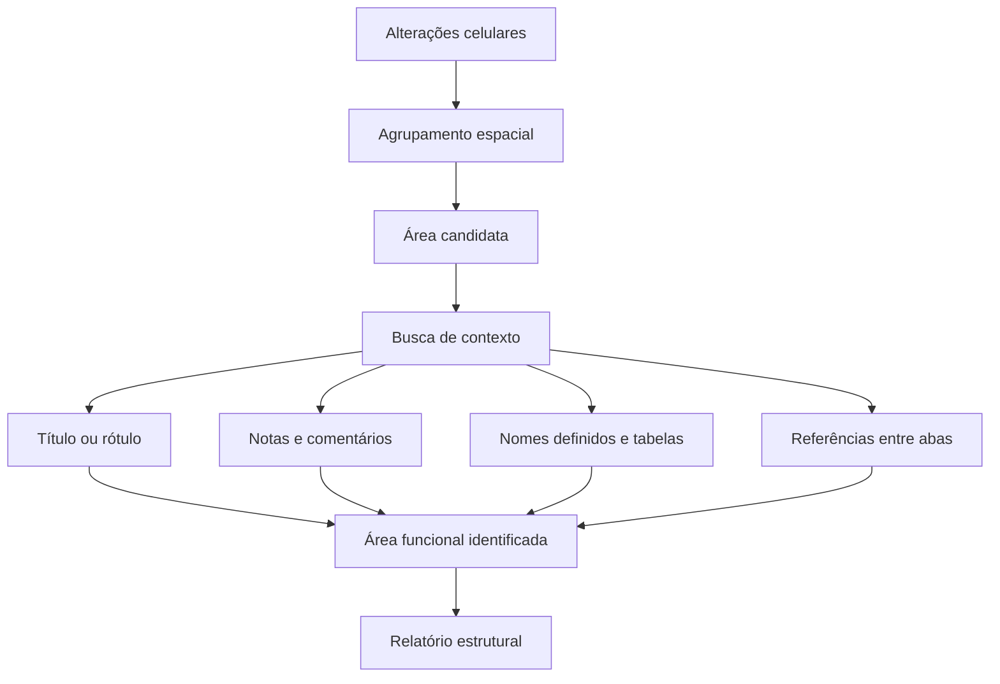
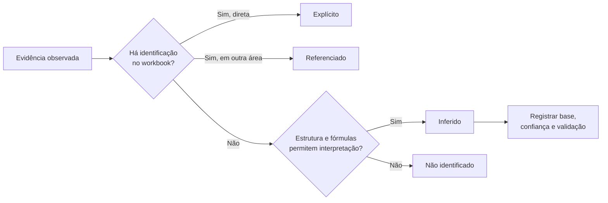
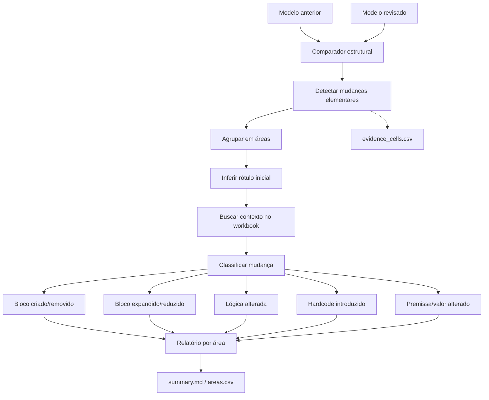
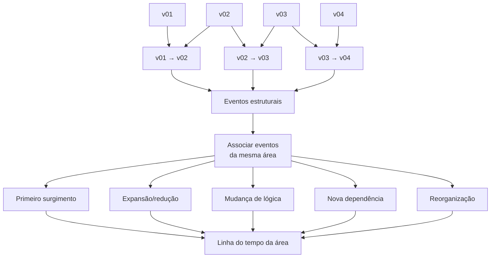

# Excel Model Review

Plugin experimental para revisar modelos Excel em duas perspectivas complementares:

- `excel-model-diff`: identifica o que mudou entre duas versões, reportando áreas/blocos funcionais em vez de uma lista célula a célula;
- `excel-model-evolution`: reconstrói como o modelo foi sendo construído ao longo de uma sequência ordenada de versões.

As duas skills compartilham um motor Python read-only. As mudanças celulares ficam preservadas como evidência auditável, mas não são a unidade principal do relatório.

## Visão geral



A ideia central é separar **detecção** de **interpretação**. O motor identifica alterações elementares; a skill tenta agrupá-las em áreas funcionais e buscar evidência no próprio workbook antes de interpretar o significado da mudança.

## As duas skills



Em termos simples:

- **Diff:** “o que mudou entre estas duas versões?”
- **Evolution:** “como este modelo chegou ao estado atual?”

## Unidade de análise

O relatório principal não deve ser uma lista célula a célula.



Exemplo:

```text
Aba: CAPEX
Área: D4:F5
Identificação: Cronograma de Investimentos

Mudança:
- horizonte ampliado;
- valores alterados;
- nova coluna temporal.

Evidência celular:
D5, E5, F4, F5
```

As células continuam disponíveis para auditoria, mas ficam em segundo plano.

## Regra epistemológica

A documentação e as respostas devem tornar explícito o salto entre observação e interpretação.



Os quatro status são:

- **Explícito:** o próprio workbook nomeia ou descreve a área ou a mudança;
- **Referenciado:** outra parte do workbook identifica ou documenta aquela área;
- **Inferido:** o significado é deduzido pela estrutura, fórmulas, dependências ou sequência das versões;
- **Não identificado:** a evidência não é suficiente.

Nome da área e interpretação da mudança podem ter status diferentes.

## Fluxo do excel-model-diff



## Fluxo do excel-model-evolution



Uma trajetória pode resultar, por exemplo, em:

```text
Demanda — Projeção de Economias

v01 → v02: bloco incluído
v02 → v03: horizonte expandido
v03 → v04: lógica de cálculo alterada
v04 → v05: ligação criada com a aba Receita
```

## Instalar pelo marketplace

```text
/plugin marketplace add estevaoeller/Skills
/plugin install excel-model-review@estevaoeller-skills
```

Pelo terminal:

```bash
claude plugin marketplace add estevaoeller/Skills
claude plugin install excel-model-review@estevaoeller-skills
```

## Dependência Python

Requer Python 3.10+ e `openpyxl`:

```bash
python -m pip install "openpyxl>=3.1,<4"
```

## Invocar

```text
/excel-model-review:excel-model-diff
/excel-model-review:excel-model-evolution
```

O Claude Code também pode selecionar as skills automaticamente quando a descrição for pertinente.

## Saídas do diff

- `summary.md`: relatório principal por área;
- `areas.csv`: uma linha por área alterada;
- `evidence_cells.csv`: evidência celular secundária;
- `diff.json`: resultado completo para máquina.

## Saídas do evolution

- `evolution.md`: linha do tempo por área funcional;
- `evolution.json`: evidências e eventos consolidados.

## Limitações atuais

- fórmulas são comparadas como texto; Excel não é recalculado;
- Power Query, Power Pivot/Data Model, VBA, charts, shapes e conexões externas ainda não recebem análise semântica profunda;
- agrupamento de áreas e inferência de rótulos são heurísticos e devem ser validados em layouts ambíguos;
- a associação da mesma área entre versões ainda depende principalmente de rótulo, posição e proximidade estrutural.
