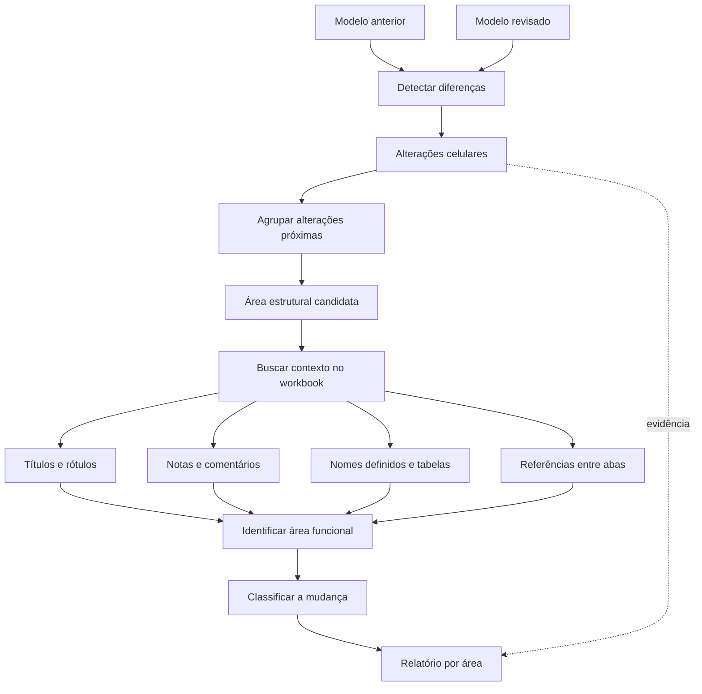
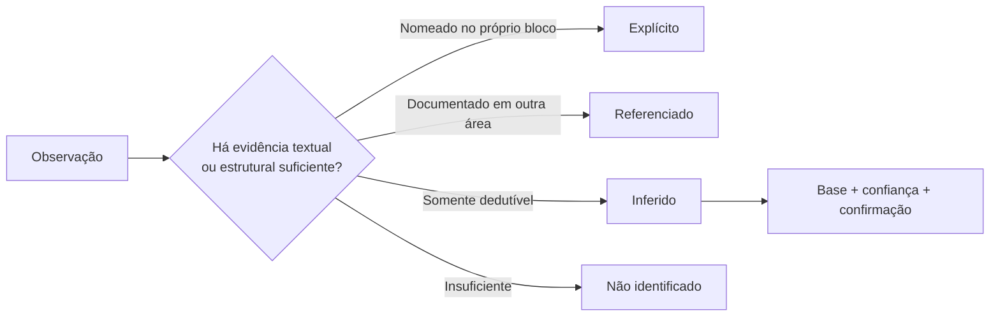

# Excel Model Diff

Compare duas versões Excel usando **áreas funcionais como unidade principal de análise**. As células são evidência, não o relatório.

## Esquema da análise



O caminho desejado é:

```text
células alteradas
      ↓
área afetada
      ↓
nome/rótulo da área
      ↓
tipo de mudança
      ↓
interpretação e relevância
```

## Regra epistêmica

**Não ocultar o salto entre observação e interpretação.**



Separe sempre:

- **Explícito**: o próprio workbook nomeia ou descreve a área/mudança.
- **Referenciado**: outra parte do workbook identifica, documenta ou aponta para a área.
- **Inferido**: significado ou finalidade deduzidos por estrutura, fórmulas, dependências ou conteúdo.
- **Não identificado**: evidência insuficiente.

Nome do bloco e interpretação da mudança podem ter status diferentes. Exemplo: o nome "População Total" pode ser explícito, enquanto "internalização da série antes estática" é uma inferência.

## Mapeamento antes do diff

Antes de dar nome a uma área, procure contexto no workbook inteiro:

1. títulos, subtítulos e cabeçalhos;
2. rótulos à esquerda/acima e textos auxiliares;
3. células mescladas, negrito, bordas e mudanças visuais que marquem seções;
4. comentários/notas de célula;
5. nomes definidos e nomes de tabelas;
6. abas de metodologia, memória, premissas, instruções, notas ou "passo a passo";
7. fórmulas e referências que liguem o bloco a outras abas;
8. textos explicativos pequenos, inclusive expressões como ajuste, projeção, estimativa, fonte, premissa, calculado conforme, multiplica, divide, utilizado em, método e modelo.

Não trate automaticamente rótulos de linha, municípios, anos ou categorias como título do bloco.

## Procedimento

1. Identifique base/anterior e revisada/posterior.
2. Verifique `openpyxl>=3.1,<4`.
3. Execute o comparador estrutural.
4. Leia primeiro `summary.md` e `areas.csv`.
5. Para cada área material, busque evidência semântica no workbook antes de aceitar o rótulo geométrico.
6. Consulte `evidence_cells.csv` para validar a mudança, não para montar o relatório principal.
7. Registre a proveniência do nome e da interpretação.
8. Crie pendência quando a interpretação exigir confirmação humana.
9. Não modifique nem salve os arquivos de origem.

## Comando

```bash
python "$CLAUDE_PLUGIN_ROOT/scripts/compare_structural.py" "OLD.xlsx" "NEW.xlsx" --out "excel-model-diff-report"
```

## Formato de resposta

Tabela principal:

`Aba | Área | Identificação | Status do nome | Mudança | Status da interpretação | Evidência | Pendência`.

Depois explique apenas as áreas relevantes.

Para inferências, use:

- **Inferência**
- **Base da inferência**
- **Confiança**: alta/média/baixa
- **Confirmar**: pergunta ou verificação necessária

Nunca apresente uma inferência como fato documentado.

## Distinção


Responde **"o que mudou entre estas duas versões?"**. Para história de construção ao longo de várias versões, use `excel-model-evolution`.
