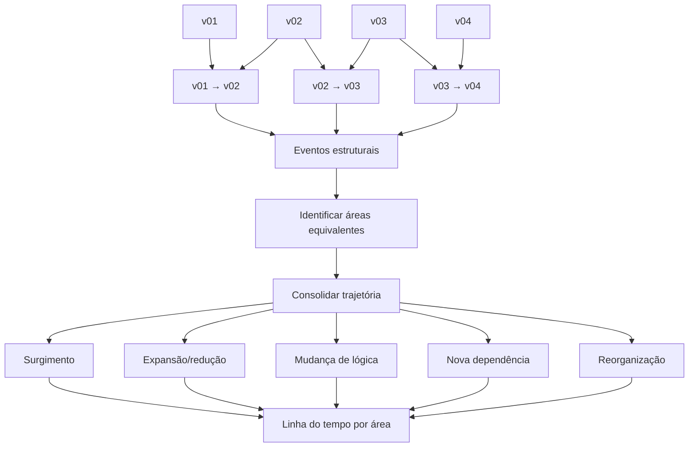
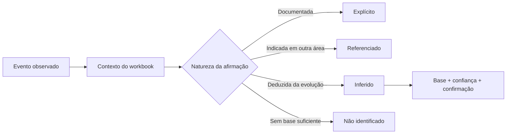
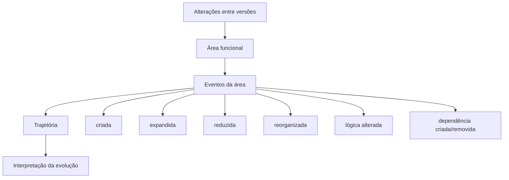
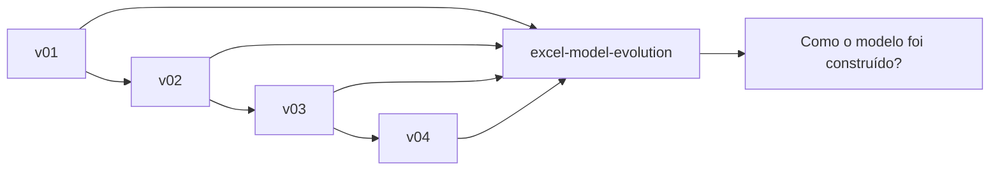

# Excel Model Evolution

Reconstrua **como o modelo chegou da versão inicial ao estado atual**. Não é apenas um multi-diff.

## Esquema da análise



O foco não é acumular diferenças. O foco é transformar diferenças sucessivas em uma **história estrutural do modelo**.

Exemplo:

```text
Projeção de Economias

v01 → v02: bloco criado
v02 → v03: horizonte temporal ampliado
v03 → v04: fórmula passa a usar população projetada
v04 → v05: bloco passa a alimentar Receita
```

## Regra epistêmica

**Não ocultar o salto entre observação e interpretação.**



Classifique afirmações relevantes como:

- **Explícito**: documentado/nomeado no workbook.
- **Referenciado**: explicado ou apontado por outra área/aba.
- **Inferido**: deduzido por estrutura, fórmulas, dependências ou sequência das versões.
- **Não identificado**: evidência insuficiente.

Uma fase de desenvolvimento como "refinamento metodológico" é inferência, salvo se o próprio arquivo a documentar.

## Unidade de análise

Use áreas funcionais: premissas, demanda, projeções, CAPEX, OPEX, receita, financiamento, fluxo, indicadores, sensibilidades e outros blocos efetivamente encontrados.



Antes de nomear cada bloco, procure no workbook inteiro:

- títulos/cabeçalhos e rótulos;
- notas, comentários e textos auxiliares;
- nomes definidos e tabelas;
- abas metodológicas, memórias, instruções e passo a passo;
- fórmulas/referências entre abas;
- textos pequenos que descrevam operações ou finalidade.

## Procedimento

1. Estabeleça a ordem das versões.
2. Compare pares consecutivos pelo motor estrutural.
3. Mapeie contexto semântico de cada versão, não apenas células alteradas.
4. Converta diffs em eventos: bloco criado, expandido, reduzido, removido, reorganizado, lógica introduzida/alterada, dependência criada/removida, hardcode introduzido/removido.
5. Consolide eventos da mesma área usando rótulo + estrutura + proximidade + referências, não somente coordenadas.
6. Separe observação da interpretação.
7. Para inferências, registre base, confiança e ponto a confirmar.
8. Não atribua intenção de projeto sem evidência.
9. Não modifique os workbooks.

## Comando

```bash
python "$CLAUDE_PLUGIN_ROOT/scripts/evolution.py" "v01.xlsx" "v02.xlsx" "v03.xlsx" "v04.xlsx" --out "excel-model-evolution-report"
```

## Formato de resposta

Comece pela linha do tempo estrutural e depois organize por área. Em cada evento relevante mostre:

- versão/transição;
- área e intervalo;
- evento observado;
- fonte/status da identificação;
- interpretação, se houver;
- status da interpretação;
- evidência;
- confiança;
- pendência de validação.

Fases como estruturação inicial, inclusão de premissas, construção de motores, integração, calibração e consolidação só devem ser usadas quando sustentadas; marque-as como inferidas quando forem interpretação.

## Distinção



Responde **"como o modelo foi construído/evoluiu entre versões?"**. Para duas versões específicas, use `excel-model-diff`.
